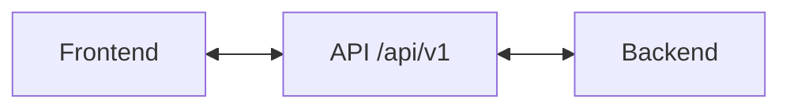
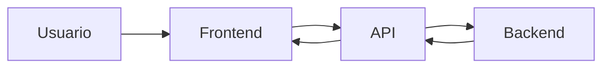

# Diseno de la aplicacion

Este documento resume la arquitectura elegida para la app de finanzas personales.

## 1. Estructura general

La aplicacion se divide en 2 partes:

- `frontend/`: interfaz hecha con React + TypeScript.
- `server/`: backend con una API REST para guardar y consultar datos.

Idea general:



## 2. Componentes principales

En el frontend, los componentes principales seran:

- `Layout`: estructura general de la app.
- `HomePage` o `DashboardPage`: resumen del mes.
- `TransactionsPage`: listado de movimientos.
- `TransactionList`: muestra varias transacciones.
- `TransactionCard`: muestra una transaccion.
- `TransactionForm`: formulario para crear o editar movimientos.

## 3. Componentes reutilizables

Los componentes reutilizables seran los que no tengan logica de negocio:

- `Button`
- `Card`
- `Field`
- `Modal`

Los componentes de negocio seran los de transacciones, categorias y presupuestos.

## 4. Manejo del estado

Se usaran dos tipos de estado:

- Estado local del cliente:
  modales abiertos, filtros, formularios, mes seleccionado.
- Estado del servidor:
  transacciones, categorias, presupuestos y reportes.

Decision:

- `useState` para cosas simples de la interfaz.
- `Context` si algun estado se comparte entre varias pantallas.
- Los datos importantes van en el backend, no solo en el frontend.

## 5. API REST

La API va a estar versionada bajo:

- `/api/v1`

Recursos principales:

- `GET /api/v1/health`
- `GET /api/v1/transactions`
- `POST /api/v1/transactions`
- `PATCH /api/v1/transactions/:id`
- `DELETE /api/v1/transactions/:id`
- `GET /api/v1/categories`
- `POST /api/v1/categories`
- `PATCH /api/v1/categories/:id`
- `DELETE /api/v1/categories/:id`
- `GET /api/v1/budgets?month=YYYY-MM`
- `PUT /api/v1/budgets/:month`
- `GET /api/v1/reports/summary?month=YYYY-MM`

## 6. Contratos de datos

### Transaction

```json
{
  "id": "txn_1",
  "type": "expense",
  "amountMinor": 125000,
  "currency": "EUR",
  "categoryId": "cat_food",
  "date": "2026-04-23",
  "note": "Supermercado"
}
```

### Category

```json
{
  "id": "cat_food",
  "name": "Comida",
  "type": "expense",
  "color": "#22c55e"
}
```

### Budget

```json
{
  "month": "2026-04",
  "totalAmountMinor": 800000,
  "currency": "EUR",
  "byCategory": [
    {
      "categoryId": "cat_food",
      "amountMinor": 200000
    }
  ]
}
```

## 7. Que se guarda en servidor y que queda en cliente

Se guarda en el servidor:

- transacciones;
- categorias;
- presupuestos.

Queda solo en el cliente:

- estado de modales;
- filtros;
- preferencias visuales;
- datos temporales de formularios.

## 8. Flujo de datos



## 9. Decision final

Se eligio una arquitectura simple:

- frontend en React;
- backend con API REST;
- datos importantes persistidos en servidor;
- componentes UI reutilizables separados de los componentes de negocio.

Es una solucion suficiente para una app de bootcamp porque es clara, ordenada y facil de ampliar mas adelante.
